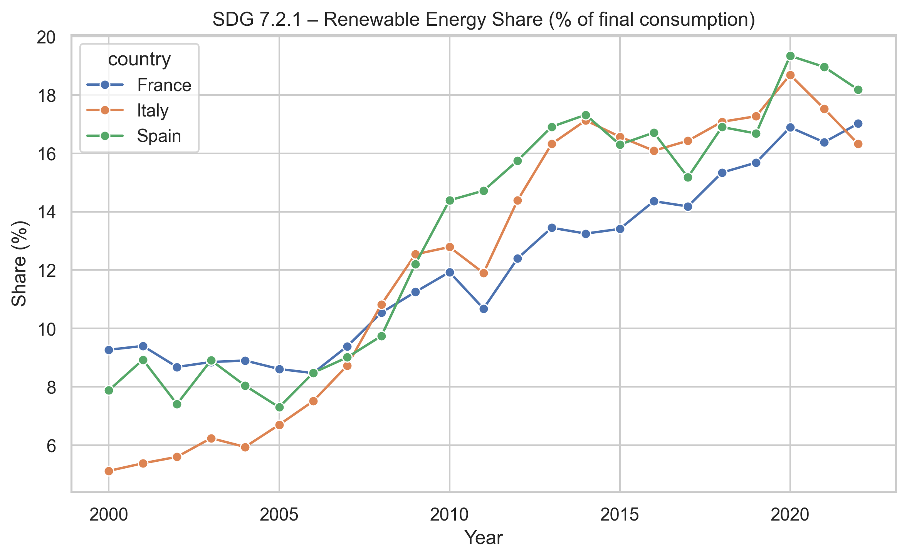

# Renewable Energy Share Analysis (SDG 7.2.1)

## Project Overview
This project analyzes the evolution of renewable energy share in total final energy consumption (**SDG 7.2.1**) across **Italy, Spain, and France** between **2000 and 2022**, using data from the United Nations.

The objective is to compare how these countries progressed over time, identify differences in growth patterns, and evaluate the consistency of their transition toward renewable energy.

---

## Objectives
- Analyze the evolution of renewable energy share over time  
- Compare performance across Italy, Spain, and France  
- Measure total growth, average annual growth, and variability  
- Interpret differences in long-term transition patterns  

---

## Dataset
- **Source:** United Nations Sustainable Development Goals (SDG) database  
- **Indicator:** SDG 7.2.1 – Renewable energy share in total final energy consumption  
- **Time period:** 2000–2022  
- **Countries analyzed:** Italy, Spain, France  

---

## Tools & Technologies
- **Python**
- **pandas** (data manipulation)
- **matplotlib & seaborn** (data visualization)
- **SQL (SQLite)** (data querying and structuring)
- **Excel** (original data format)

---

## Project Structure
```bash
renewable-energy-analysis/
│
├── data/
│   ├── raw/
│   │   └── SDG_Renewable_Energy.xlsx
│   │
│   └── processed/
│       └── SDG_721_clean.csv
│
├── notebooks/
│   └── 01_SDG_Data_Exploration.ipynb
│
├── outputs/
│   ├── figures/
│   │   └── renewable_energy_trends.png
│   │
│   └── tables/
│       ├── latest_ranking.csv
│       ├── growth_analysis.csv
│       ├── avg_growth.csv
│       └── volatility.csv
│
├── README.md
├── requirements.txt
```
---

## Analysis Workflow
1. Loaded and inspected the dataset  
2. Selected and renamed relevant variables  
3. Cleaned the data (handled missing values and filtered time range)  
4. Filtered the dataset for Italy, Spain, and France  
5. Performed exploratory analysis and visualization  
6. Computed key metrics:
   - latest ranking  
   - total and relative growth  
   - average annual growth  
   - volatility (standard deviation)  

---

## Key Insights
- **All three countries show a clear upward trend** in renewable energy adoption from 2000 to 2022  
- **Italy exhibits the strongest growth**, both in absolute terms and average annual increase  
- **Spain reaches the highest final level in 2022**, indicating strong long-term performance  
- **France shows slower but more stable growth**, suggesting a more gradual transition  
- **Italy and Spain display higher variability**, while France follows a steadier trajectory  

---

## Visualization


---

## Conclusions
The analysis highlights that renewable energy adoption increased in all three countries, but through different transition paths.  

**Italy grew faster**, **Spain reached the highest level**, and **France followed a more stable trajectory**.  

Overall, the results suggest that **both growth intensity and stability influence long-term outcomes**, and that **different national strategies can lead to similar levels of renewable energy adoption**.

---

## Limitations
- Analysis limited to three countries  
- No inclusion of explanatory variables (e.g. policy, investments, GDP)  
- Focused on descriptive and comparative analysis  

---

## Future Improvements
- Extend analysis to more countries  
- Integrate policy and economic indicators  
- Build an interactive dashboard  
- Explore predictive modeling  

---

## How to Run the Project

1. Clone the repository:
```bash
    git clone https://github.com/chiudioniluca-data/renewable-energy-analysis.git
```
2. Install dependencies:
```bash
    pip install -r requirements.txt
```
3. Open the notebook:
- Jupyter Notebook or VS Code

4. Run all cells to reproduce the analysis

---

## Author

Junior Data Analytics portfolio project developed as part of a career transition into data analytics.


